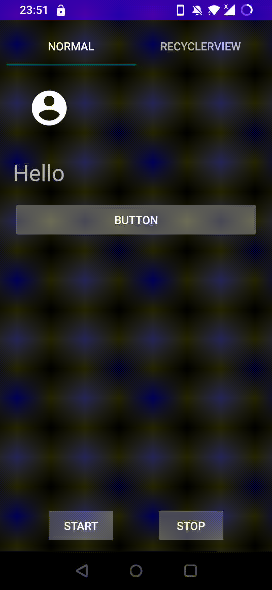

<h1 align="center">Skeleton</h1></br>

<p align="center">
    Demo skeleton for loading like facebook, linkedin,...
</p><br>

<p align="center">

</p>

## Download
Update later

### Gradle

Add the dependency below to your **module**'s `build.gradle` file:
```gradle
dependencies {
    implementation "io.github.stevepham:skeleton:1.0.0"
}
```

## Usage

```kotlin
    val config = ShimmerConfig(maskColor, shimmerColor, duration, angle) // init your config
    val skeleton = yourView.generateSkeleton(config) // for normal view
    val rvSkeleton = recyclerView.generateSkeleton(config, layoutId = R.layout.your_recycler_view_item, itemCount = 1) // for recyclerview

    skeleton.showSkeleton() // show skeleton while loading

    skeleton.showOriginal() // show normal view after content load finished

```